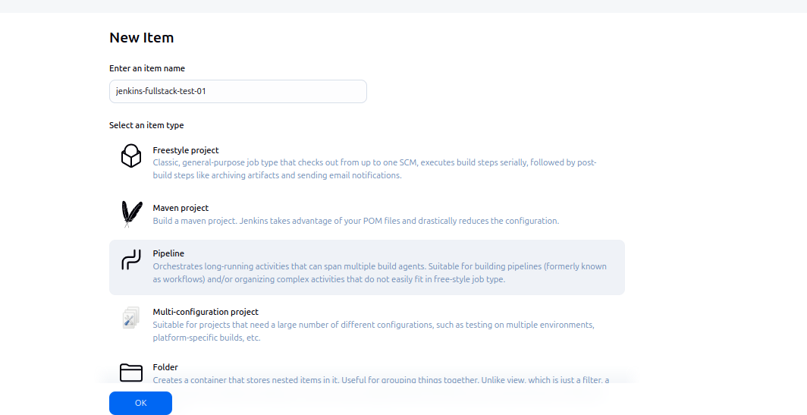
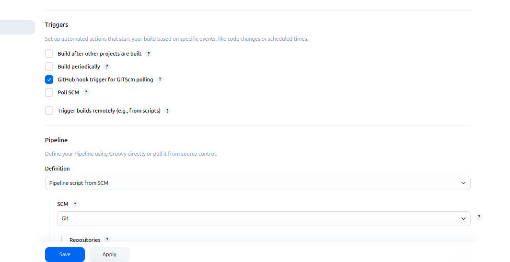
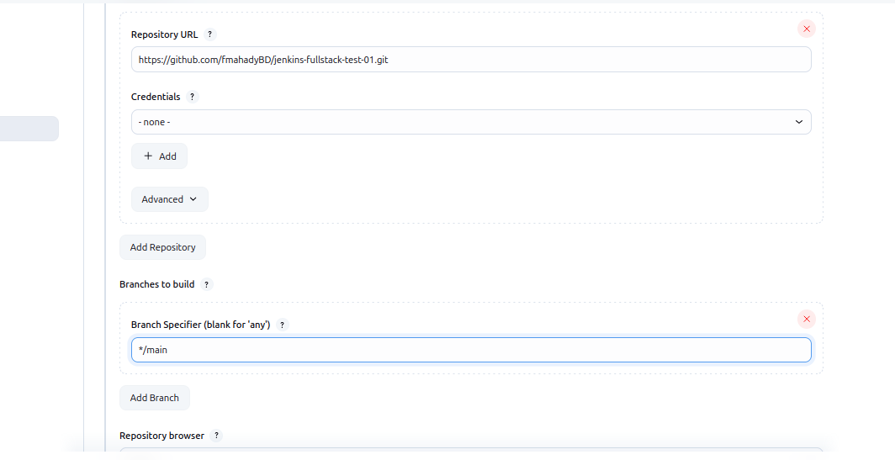

---

# Setup Jenkins

### 1. Create a New Job

* Open Jenkins.
* Click on **“New Item”**.
* Give your job a name.
* Select **"Pipeline"** and click **OK**.

### 2. Configure Git Repository

* In the job configuration, scroll to the **"Pipeline"** section.
* Under **"Pipeline script from SCM"**, select **"Git"**.
* Enter your repository URL:

  ```
  https://github.com/fmahadyBD/jenkins-fullstack-test-01
  ```



---

### 3. Set Build Trigger

* Scroll to the **"Build Triggers"** section.
* Check the option:

  * ✅ **GitHub hook trigger for GITScm polling**



---

### 4. Pipeline Script Configuration

* Under **"Pipeline script from SCM"**:

  * Make sure **SCM** is set to **Git**.
  * Provide the same repository URL.
  * If your Jenkinsfile is not in the root, set the correct script path.



---

